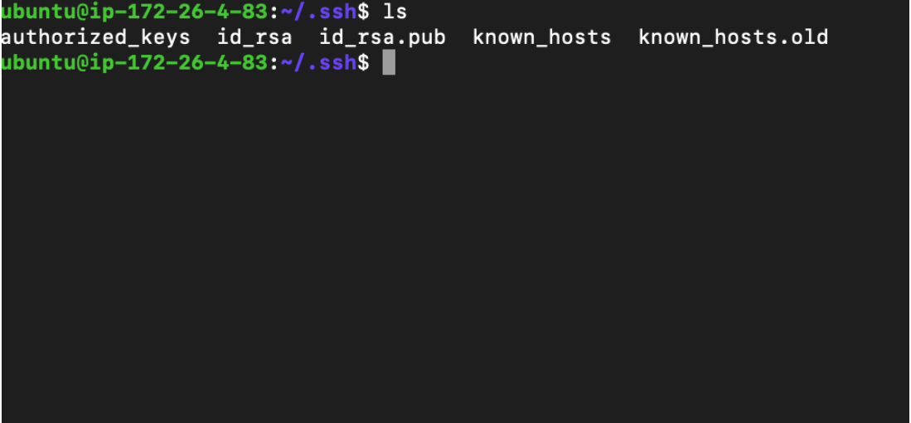
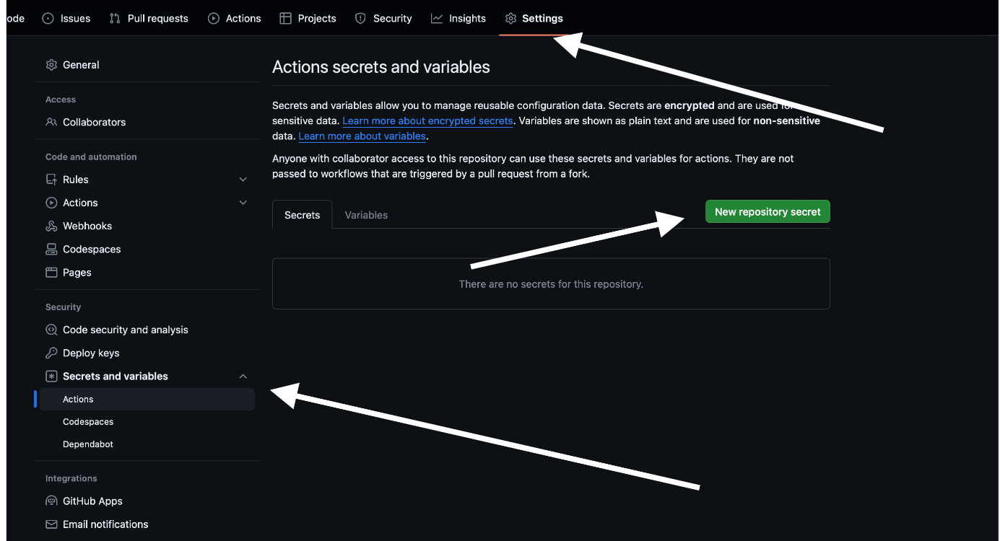
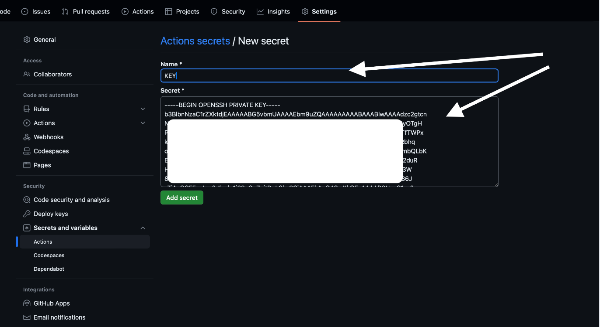

## Projectga CI & CD ulash

CI & CD ni biz deployment qilishda vahtni tejash va samaradorlikni oshirish
maqsadida ishlatamiz.

### CI yozishimiz kerak Continuous Integration(uzluksiz integratsiya)

Uzluksiz integratsiya (CI) umumiy omborga tez-tez kod berishni talab qiladigan dasturiy ta'minot amaliyotidir. 

### Loyha ichida .github/workflows/ file ochib shu fileni ichiga ci.yml nomli file ochilad

```xml
name: PROJECT CI

on: [push]

jobs:
  run-test:
    services:
      postgres:
        image: postgres:14.8
        env:
          POSTGRES_DB: database nomi
          POSTGRES_USER: data base user
          POSTGRES_PASSWORD: paroli
        ports:
          - 5432:5432

    runs-on: ubuntu-latest
    env:
      DJANGO_SETTINGS_MODULE: root.settings
    steps:
      - uses: actions/checkout@v2
      - uses: actions/setup-python@v2
        with:
          python-version: 3.10.5
      - name: Install requirements
        run: pip3 install -r requirements.txt
```

## CD Continuous Deployment (Uzluksiz Joylashtirish)

Siz dasturiy mahsulotingizni joylashtirish uchun GitHub Actions ish jarayonini sozlashingiz mumkin.

##### github/workflows/ file  cd.yml  file yaratamiz
```xml
name: PROJECT CD

on:
  push:
    branches: [master]

jobs:
  test:
    services:
      postgres:
        image: postgres:14.8
        env:
          POSTGRES_DB: database nomi
          POSTGRES_USER: data base user
          POSTGRES_PASSWORD: paroli
        ports:
          - 5432:5432

    runs-on: ubuntu-latest
    env:
      DJANGO_SETTINGS_MODULE: root.settings
    steps:
      - uses: actions/checkout@v2
      - uses: actions/setup-python@v2
        with:
          python-version: 3.10.5
      - name: Install requirements
        run: pip3 install -r requirements.txt

  deploy:
    runs-on: ubuntu-latest
    needs: test
    steps:
      - name: connect and deploy
        uses: appleboy/ssh-action@v1.0.0
        with:
          host: sizningdominginiz.com yoki .uz
          username: root
          key: ${{ secrets.KEY }}
          script: |
            cd loyha/
            git pull
            sudo systemctl restart gunicorn.socket gunicorn.service
```

CD  uchun ``KEY`` qo'shish kerak
buning uchun serverda ``cd .ssh/`` qilib ssh filega kirladi



### yengi ssh key yaratamiz github-actions nomli
### github-actions.pub ni copy(nusxa)lab authorized_key ga post qilamiz

### github-actions ning private keyni copy qilib

### github repositoryning settings qismiga kirib yangi secret qo'shilad.


### Va biz CD ni ham github ga push qilsak bo'ladi va har push bo'lganda serverda ham o'zgarishlar amalga oshirliadi.
